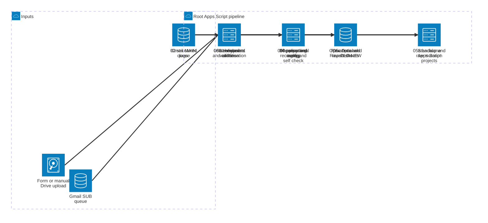

# Workflow Second Brain

Google Apps Script untuk ingestion, normalisasi, routing, enrichment, dan monitoring claim pada satu master workbook, ditambah empat automation standalone yang mempunyai deployment sendiri.

Dokumen ini adalah handbook current-state. Konfigurasi dan business rule tetap dieksekusi dari kode; README membantu manusia menemukan contract, owner, failure boundary, dan cara memvalidasinya tanpa perlu melakukan arkeologi kecil setiap kali ada perubahan.

## Quick Validation

Requirement lokal: Node.js `22.x` dan npm.

```bash
npm ci
npm run check
```

Command yang lebih sempit:

| Command | Scope |
| --- | --- |
| `npm run check:root` | Load-order dan static smoke check root Apps Script. |
| `npm run check:standalone` | Syntax check empat script di `optional-project/`. |
| `npm run check:mappings` | Contract tests mapping, routing, header, dan manual-field ownership. |
| `npm run check:docs` | Markdown, local link/anchor, heading policy, Mermaid, dan knowledge-file policy. |
| `npm run check:diff` | Documentation-drift dan sensitive-added-lines gate. |

Static validation tidak membuktikan behavior Gmail, Drive, Spreadsheet, trigger, quota, permission, atau Apps Script runtime. Gunakan [Apps Script UAT](#apps-script-uat) sebelum release yang menyentuh runtime.

## Document Ownership and Source Precedence

Repository hanya mempunyai tiga knowledge files yang dilacak Git:

| File | Isi | Bukan tempat untuk |
| --- | --- | --- |
| `AGENTS.md` | Durable invariants, ownership, agent workflow, impact rules, definition of done. | Mapping rinci, schema volatil, atau diary fix. |
| `README.md` | Current state, architecture, flow, mapping, data/config contract, runbook, dan UAT. | Histori berbasis tanggal. |
| `CHANGELOG.md` | `Unreleased` dan histori outcome per tanggal. | Duplikasi handbook atau debugging diary. |

Jika informasi bertentangan, gunakan urutan:

1. instruksi task aktif;
2. regression test dan behavior kode yang terverifikasi;
3. durable contract di `AGENTS.md`;
4. current-state handbook ini;
5. histori di `CHANGELOG.md`.

Expected contract dan observed implementation bukan hal yang sama. Implementasi yang bertentangan dengan contract tidak otomatis menjadi benar hanya karena kebetulan sedang berjalan.

## Glossary

| Istilah | Arti |
| --- | --- |
| MAIN | Full ingest dari daily monitoring export ke `Raw Data`, lalu rebuild/routing dan post-process. |
| SUB | Incremental ingest pasangan OLD/NEW untuk update dan relocation claim existing. |
| FORM | Form/Drive adapter yang memakai shared MAIN atau SUB core. |
| Operational sheet | Destination utama seperti `Submission`, `Start`, SC owner sheets, `Finish`, `PO`, dan exclusion queues. |
| Optional sheet | Output dengan contract khusus: `B2B`, `EV-Bike`, `Doss`, dan `Special Case`. |
| Canonical header | Nama field utama yang diharapkan runtime; alias hanya compatibility layer. |
| Manual field | Nilai/formula user-managed yang harus bertahan melewati clear, route, dan relocation. |
| Success boundary | Titik ketika output penting sudah berhasil sehingga cleanup input boleh dilakukan. |
| Pending SUB | Marker durable ketika SUB tidak memperoleh script lock karena MAIN sedang berjalan. |
| Continuation | MAIN dua eksekusi yang dihubungkan token Script Property dan one-shot trigger. |
| UAT | Verifikasi di Apps Script/workbook nyata; berbeda dari static test lokal. |

## System Context and Architecture



Policy dan config berada terutama di `00_Config.gs`; generic utility di `01_Utils.gs`; log lifecycle di `02_LogAndDetails.gs`; schema/layout di `03_SheetsAndValidation.gs`; parsing di `04_ParseAndAging.gs`; dan processing di `05*` serta `06*`. Standalone scripts tidak berbagi load order maupun global root.

## Repository Map

| Path | Owner utama | Ubah ketika |
| --- | --- | --- |
| `00_Config.gs` | Policy registry, status/routing maps, SC keywords, flags, Script Property defaults. | Business policy atau environment knob berubah. |
| `01_Utils.gs` | Safe I/O, normalization, coercion, retry, header matching, Gmail/Drive helpers. | Helper generik dengan contract lintas flow berubah. |
| `02_LogAndDetails.gs` | Structured log, progress, details, RunID, error context. | Observability atau layout log berubah. |
| `03_SheetsAndValidation.gs` | `SV03_TEMPLATES`, schema/layout, dropdown, checkbox, formatting. | Destination column/template berubah. |
| `04_ParseAndAging.gs` | Source parsing, dates, aging. | Input interpretation berubah. |
| `05a_Pipeline_RawMutate_Backup.gs` | Raw mutation serta backup ke Raw. | Pre-route mutation atau durable manual backup berubah. |
| `05b_Pipeline_RoutingOperational.gs` | Operational destination selection, row writer, SC split, reject window, highlight. | Status/SC routing atau operational output berubah. |
| `05c_Pipeline_OptionalSheets.gs` | B2B, EV-Bike, Doss, Special Case. | Optional-sheet eligibility atau output berubah. |
| `06a_EntryPoints.gs` | Trigger/entrypoint, queue, lock, pending SUB, FORM/SUB orchestration. | Trigger, ingestion, cleanup, atau relocation berubah. |
| `06b_PipelineAndEnrichment.gs` | MAIN pipeline, enrichment, strict date sync, continuation stage. | Pipeline sequence atau enrichment berubah. |
| `06c_PostProcessAndUtils.gs` | Manual restore, Daily/Weekly Report Base, maintenance, self-check. | Recovery, reporting, atau runtime assertions berubah. |
| `optional-project/Service Center Extractor.js` | SC transfer dari root outputs ke workbook Service Center. | Destination SC tab/PIC/branch mapping berubah. |
| `optional-project/SC-Meilani.js`, `optional-project/SC-GSI.js`, `optional-project/SC-Sitcomtara.js`, `optional-project/SC-Mitracare.js`, `optional-project/SC-iBox.js` | Manual mirror Salvage, upsert Salvage Repair, dan backup Remarks per branch/service-center standalone. `SC-Meilani.js` sekarang menjadi profile `SC - Unicom` untuk Unicom/Samsung Exclusive/Xiaomi Authorized; file lain mewakili GSI, Sitcomtara, Mitracare, dan iBox. | Branch/status/header contract project ini berubah. |
| `optional-project/salvage` | Gmail salvage ingest dan upsert `Salvage 25-26`. | Salvage source, target, mapping, atau scheduling berubah. |
| `optional-project/Outstanding` | Hourly queue mirroring ke Claim Outstanding. | Region/PIC routing, queue, retry, atau preserved fields berubah. |
| `static_smoke_check.js` | Legacy root static harness yang dipanggil tooling Node. | Root symbol/load-order assertion berubah. |
| `scripts/`, `tests/` | Local validators dan regression contracts. | Developer interface atau guard berubah. |

## Flow Registry

### MAIN

| Contract | Current behavior |
| --- | --- |
| Trigger/input | `runEmailIngest()` membaca maksimal satu thread dari label `QUEUED_MAIN`, unread, ber-attachment; `runManual()` dan FORM MAIN memakai core yang sama. |
| Lock/idempotency | Script lock dengan timeout 30 detik; queue query deterministic; transaction/idempotency guard aktif secara default. |
| Processing | XLSX dikonversi, ditulis ke `Raw Data`, manual state dibackup, lalu route, restore, enrich, optional processors, Daily Report Base, sort, dan finalization. |
| Continuation | MAIN dapat berhenti setelah stage 1, menyimpan `MAIN_PIPELINE_STAGE2`, lalu one-shot trigger menjalankan stage 2 dengan RunID yang sama. Progress bersifat kumulatif. |
| Success boundary | Cleanup Gmail/temp hanya sesudah route/finalization sukses. Jika gagal, queued email dipertahankan untuk retry. |
| Cleanup | Success: mark read, remove queue label, trash thread/temp sesuai policy. Failure: input tidak dikonsumsi. |
| Recovery | Stage 2 membaca snapshot durable stage 1. `_OPS_MAIN_SUB_TEMP` dipertahankan untuk handoff SUB pukul 09:00. |
| UAT minimum | Satu email valid, satu invalid attachment, rerun yang sama, manual-field/formula restore, stage-2 continuation, report refresh, dan cleanup success/failure. |

### SUB

| Contract | Current behavior |
| --- | --- |
| Trigger/input | `runSubEmailIngest()` membaca queue `QUEUED_SUB`; membutuhkan attachment NEW yang mengandung `(Standardization)` dan OLD yang mengandung `List of Claims with Aging`. FORM SUB memakai file Drive. |
| Lock/idempotency | Script lock; bila MAIN sibuk, `WORKFLOW_SUB_PENDING_AFTER_MAIN` dibuat dan didrain sekali setelah MAIN melepas lock. |
| Processing | Isi `Raw OLD`/`Raw NEW`, append kandidat baru ke `Submission`, update claim existing, relocate lintas operational sheets, refresh EV-Bike/Doss/B2B existing sesuai contract, sort, dan refresh reports. |
| Success boundary | Kedua input valid dan seluruh core update/relocation selesai. |
| Cleanup | Email/temp hanya dibersihkan setelah success; state retryable dipertahankan ketika gagal. |
| Recovery | Handoff `_OPS_MAIN_SUB_TEMP` hanya direstore pada window jam 09:00; fallback manual backup tetap tersedia. Pure SUB menjalankan Weekly Report Base hanya jam 09:00 dan maksimal sekali per tanggal. |
| UAT minimum | Missing OLD/NEW, same-bucket vs changed-bucket `Stage Aging`, pending lock, cross-sheet relocation, reject/expired movement, manual fields, optional refresh, dan email retry. |

### FORM and MANUAL

| Contract | Current behavior |
| --- | --- |
| Trigger/input | `onFormSubmit(e)` membaca field `Flow` dan upload `Metabase - Upload Claim Data`; field OLD/NEW terpisah bersifat optional. `runManual()` menerima file IDs. |
| Lock/idempotency | Memakai lock dan shared core flow asal; tidak mempunyai business-rule fork sendiri. |
| Processing | Deteksi MAIN/SUB, bentuk request, lalu delegasi ke pipeline yang sama. |
| Success boundary | Sama dengan flow yang dipilih. |
| Cleanup | File upload mengikuti cleanup policy shared flow setelah sukses. |
| Recovery | Error dicatat dengan flow/source context; FORM SUB boleh refresh Weekly Report Base segera setelah selesai. |
| UAT minimum | MAIN upload, SUB two-file upload, auto-detection, field yang hilang, file duplikat, log/timing, dan cleanup. |

### Standalone Projects

| Project | Entry/trigger | Lock/idempotency | Success and recovery contract |
| --- | --- | --- | --- |
| Service Center Extractor | `runServiceCenterTransfer()`; menu via `onOpen()`. | Script lock, minimum run interval, RunID properties. | Batch read/write, append log `Log - SC Transfer`, unmapped quarantine, dan verify destination. Setelah bucket PIC/fase selesai, bucket Unicom/Samsung Exclusive/Xiaomi Authorized dimirror ke `Repair` workbook yang ditentukan Script Property `SC_REPAIR_MIRROR_UNICOM_SPREADSHEET_ID`, sedangkan bucket Sitcomtara memakai `SC_REPAIR_MIRROR_SITCOMTARA_SPREADSHEET_ID`. Refresh mempertahankan `Update from Service Center` by `Claim Number`, membuat hyperlink dashboard, serta memasang dropdown ketat `Status Type`. |
| SC branch standalone | Menu `Salvage`, `Salvage Repair`, `Start Repair`, `Backup Repair Remarks`, `Update SC Universe Remarks`, `Run All` per profile (`SC - Unicom`, `SC - GSI`, `SC - Sitcomtara`, `SC - Mitracare`, `SC - iBox`). | Script lock, active-run/stop properties per deployment. | Mirror/upsert by claim; Salvage Repair reads explicit `Raw Data` raw headers, derives dashboard hyperlink text `LINK` from Claim Number, only includes Approval Date >= 1 Aug 2026, supports optional target columns/sheet override, dan sort Branch A-Z lalu Approval Date tertua. `Start Repair` membaca branch `Overview!G2:G4`, mempertahankan feedback, dan menerapkan dropdown ketat `Status Type`. Trigger `Update SC Universe Remarks` menyalin feedback by `Claim Number` ke owner: Unicom/GSI → `SC - Meilani`, Sitcomtara/Mitracare/iBox → `SC - Farhan`. |
| Salvage | `setupSalvageAutomation()` memasang daily trigger; `runQueuedSalvage()` consumer. | Script lock dan dedupe thread/message window. | Duplicate target claim fail-fast; success baru men-trash temp/thread; failure tetap tercatat di `Log Salvage`. |
| Outstanding | `install()` memasang hourly enqueue dan worker 5 menit; manual `runNow()`/`runNowFresh()`. | Per-hour idempotency, durable queue, retry/backoff, stale-run rescue, circuit breaker. | Staging lalu finalizer; preserve manual columns; system sheets menyimpan run, queue, staging, audit. |

## Canonical Mapping Registry

### Status to Destination

Daftar status lengkap dieksekusi oleh `OPS_ROUTING_POLICY.LAST_STATUS_BY_SHEET`; `STATUS_TYPE_BY_LAST_STATUS` dan `POSITION_BY_LAST_STATUS` harus berubah bersama. Ringkasan domain:

| Destination/domain | Status contract | Additional consumers |
| --- | --- | --- |
| `Submission` | `SUBMITTED`, `CLAIM_INITIATE`. | SUB append rules dan report base. |
| `Ask Detail` | Ask-detail, resubmit-document, dan reopen depan. | Position/Status Type maps. |
| `OR - OLD` | `WAITING_PAYMENT`. | SUB relocation. |
| `Start` | Walk-in/pickup/courier start statuses. `COURIER_PICKUP_START_DONE` juga terlihat di SC universe. | Service/Claim Type dan SC mirror rule. |
| SC universe | Receive, estimate, repair/on-progress, insurance review/approval, OR-repair, dan finish tracking statuses. | Split oleh `SC_NAME_KEYWORDS`, PIC, branch, Daily Report Base, standalone projects. |
| `Finish` | Repair/checkout/finish statuses; sejumlah status tetap berada di SC dan dicloning ke Finish. | SUB clone/relocate dan reporting. |
| `Expired Claim` | `CLAIM_EXPIRE`, `CLAIM_EXPIRE_WALKIN`. | SUB relocation dapat memindahkan claim keluar lagi. |
| `Reject Claim` | Status yang mengandung `reject` dan `Last Status Aging <= 30`; jika aging tidak tersedia, last-update datetime harus berada dalam 30 hari. | MAIN route, SUB relocation, `REJECT_CLAIM_TYPE_BY_LAST_STATUS`. |
| `PO` | Replacement/back-stage statuses. | `OR` serta `Service Center PIC`. |
| `Exclusion` | Done/closed/paid/cancelled/rejected domain yang tidak memenuhi active Reject Claim window. | Position, optional exclusions, reports. |
| `SC - Unmapped` | Status tidak terpetakan atau SC-universe tanpa keyword match. | Structured mapping error; token `VVMAR`/`DOSS` tidak ditahan di sini. |

Unknown status/SC harus terlihat sebagai unmapped/error evidence, bukan disamarkan oleh fallback owner. Ketika menambah status, audit routing, type, position, exclusion set, optional sheets, SUB relocation, reporting, dan regression test.

### Service Center to PIC, Branch, and Output

| Canonical match | Root operational owner | Branch/output | Standalone consumers |
| --- | --- | --- | --- |
| Mitracare, Sitcomtara, iBox | Farhan | Nama canonical masing-masing | Extractor, Salvage, Outstanding bila relevan. |
| Rejeki Seluler / Seluller | Farhan | `Rejeki Seluler` | Extractor, Salvage, Outstanding. |
| CV Berkah Athallah / CV Berkah | Farhan | `CV Berkah` atau tab `CV Berkah Athallah` sesuai project | Extractor, Salvage, Outstanding. |
| GSI | Meilani | `GSI` | Extractor, Salvage. |
| Andalas, Unicom, Xiaomi Authorized, Samsung Exclusive, Carlcare | Meilani | Nama canonical | Extractor, SC-Meilani, Salvage. |
| Samsung Authorized by Unicom variants | Meilani | `Samsung Exclusive` untuk variant/override yang dikontrak | Extractor, SC-Meilani, Salvage. |
| Klikcare, J-Bros, Makmur Era Abadi, Manado Mitra Bersama, Kayu Awet Sejahtera, MDP, B-Store, Multikom, GH Store | Meindar | Nama canonical | Extractor, Salvage, Outstanding. |
| PT Deltasindo / Deltasindo | Meindar | `Deltafone` | Extractor, Salvage, Outstanding. |
| EzCare / EZ Care | Default root: Meindar | Apple brand/type dengan valid submission date sejak 15 Jul 2026 diarahkan Farhan; non-Apple tetap Meindar. Extractor memakai split Apple/non-Apple tanpa date gate. | Root routing, Extractor, Salvage. |
| Tidak match | Tidak ada owner | `SC - Unmapped` / `Unmapped` | Masing-masing project wajib fail-closed. |

Source dan consumer utama: `OPS_ROUTING_POLICY.SC_NAME_KEYWORDS`, `BRANCH_KEYWORDS`, `05b` SC filter/override, PIC enrichment di `06b/06c`, serta mapping lokal di empat standalone scripts. Karena standalone tidak mengimpor root constants, mapping bersama harus dilindungi contract tests.

### Optional-Sheet Routing

| Sheet | Eligibility | Writer/consumer contract |
| --- | --- | --- |
| `B2B` | MAIN: `id_business_partner_category_name = B2B Partnership`; closed/expired exclusions berlaku. | `processB2B_`; tidak memakai partner-pattern/claim-token fallback. SUB tidak rebuild/append, hanya update claim existing. |
| `EV-Bike` | Claim token `VVMAR`, plus Submission overlay; configured policy-number exclusions berlaku. | `processEVBike_`; upsert by Claim Number, manual `Status` protected, deprecated Start/End/Details removed. |
| `Doss` | Claim token `DOSS`. | Memakai EV-Bike writer shape; manual `Status` protected. |
| `Special Case` | MAIN-only flags: Flex, `month_policy_aging > 12`, first-month policy, atau policy remaining under 30 days. | Fixed schema, upsert, all flagged claims retained; `Reason`, Start/End/Details remain active. |

## Data-Contract Registry

### Dataset and Identity

| Dataset/sheet | Identity key | Writer | Primary consumers | Null/failure behavior | Privacy class |
| --- | --- | --- | --- | --- | --- |
| `Raw Data` | `claim_number` | MAIN parser/pipeline | Routing, optional writers, enrichment, reports. | Required identity blank is skipped/logged; aliases normalized before lookup. | Restricted operational. |
| `Raw OLD`, `Raw NEW` | `claim_number` | SUB ingest | Submission append, updates, relocation. | Missing required attachment/header aborts flow; input remains retryable. | Restricted operational. |
| Operational sheets | `Claim Number` | `05b`, SUB relocation, `06b/06c`. | Users, Report Base, Extractor/Outstanding. | Writers only set columns present; unknown route goes quarantine. | Restricted operational. |
| `B2B` | `Claim Number` | `processB2B_` | Operations/reporting. | No replacement candidates must not erase existing dataset. | Restricted operational. |
| `EV-Bike`, `Doss` | `Claim Number` | Token writer + SUB refresh. | Operations. | Upsert/dedupe; manual Status not overwritten. | Restricted operational. |
| `Special Case` | `Claim Number` | `processSpecialCase_`. | Operations/highlight context. | Fixed schema; missing optional date does not silently invent a flag. | Restricted, policy/financial. |
| `Daily Report Base` | One current row per claim | `refreshReportBaseFromOperational06_`. | Weekly aggregation/pivots. | Full rewrite; filter removed/synchronized to avoid stale hidden rows. | Internal analytical. |
| `Weekly Report Base` | Snapshot date + aggregation dimensions | `fillWeeklyReportBase`. | Historical reporting. | Same-date run replaces snapshot; other history preserved; required column missing fails. | Internal analytical. |
| Structured logs/details | RunID + sequence/event | `02_LogAndDetails.gs` and standalone loggers. | Operators/debugging. | Start/progress/failure must remain visible; avoid raw sensitive payload. | Restricted operational metadata. |

### Canonical Header and Alias Contract

| Logical value | Canonical source | Accepted compatibility aliases | Destination/type | Null behavior |
| --- | --- | --- | --- | --- |
| Claim identity | `claim_number` | `Claim Number` | `Claim Number`, text | Blank row is not routable. |
| Submission date | `claim_submitted_datetime` | Legacy `claim_submission_date`; SUB/display variants are compatibility-only. | `Submission Date`, valid Date | Invalid/boolean values are rejected; no unrelated-field fallback. |
| Submission month | `claim_submitted_month` | `claim_submission_months`, display `Submission by Month` | First day of month, format `MMM yy` | Derived from valid Submission Date when source month absent. |
| Last status | `claim_last_status_name` | `last_status`, `Last Status` | Text | Blank/unmapped creates visible mapping evidence. |
| Last-status date | `claim_last_updated_datetime` | `last_update_datetime`, legacy last-activity variants | Date/datetime | Invalid value stays blank; reject fallback fails closed. |
| Service Center | `repairer_location_store_name` | `sc_name`, `service_center`, display variants | Text | SC-universe blank/unmatched goes `SC - Unmapped`. |
| Last Status Aging | `days_aging_from_last_activity` | `last_status_aging`, `LSA` | Number | Blank allowed; Reject Claim may fall back to last-update date. |
| Activity Log Aging | `activity_log_aging` | `ALA` | Number | Blank allowed. |
| IMEI/SN | `imei_number` | `device_imei`, IMEI/SN/serial aliases | Plain text | Comma separators removed; preserve leading zero/digits. |
| DB Link | `dashboard_link` | `db_link` variants | Link/text | Derived from Claim Number only when source blank. |
| Partner | `business_partner_name` | SUB `partner_name` | `Partner Name`, text | Blank allowed but mapping/details may log it. |
| Insurance | `insurance_partner_name` | `insurance_partner_code`, `insurance_code` | Normalized short text | Code fallback when name absent. |
| Stage Aging | Sheet-specific raw aging column | Legacy display `Aging Position`, `Aging Post.` | Number; not on Submission | Same status bucket reuses target-source value; bucket change/missing reference resets to `0`. |
| TAT | `days_aging_from_submission` | Derived for Submission/EV-Bike when required | Submission decimal-day; others numeric | Invalid source blank; Exclusion computes last-status minus submission and clamps at zero. |

Reconciled contract: current runtime treats `claim_submitted_datetime` as primary source and keeps `claim_submission_date` only as legacy fallback. Older documentation that described `claim_submission_date` as the sole strict source is historical, not current behavior.

### Managed, Manual, and Deprecated Fields

| Field group | Ownership | Preservation/write contract |
| --- | --- | --- |
| `Update Status`, `Timestamp`, `Status`, `Remarks` | Manual/restored where columns exist. | Snapshot before clear; restore fills blank destination by claim, preserving rich text, formula, wrap, format, and validation where supported. |
| `AWB`, `Timestamp AWB` | Manual/restored, primarily Start contract. | Backed up to Raw and restored after routing; formula retention is required. |
| `_OPS_MAIN_SUB_TEMP` | Hidden handoff state. | Match by Claim Number + Service Center; consumed by SUB only in the 09:00 handoff window. |
| `_OPS_MANUAL_BACKUP` | Hidden fallback state. | Match by PIC + Claim Number when normal snapshot restore misses. |
| `OR` | Template/manual field on relevant layouts. | Do not treat as universal raw field. |
| `Start Date`, `End Date`, `Details` | Layout-dependent. | Active for operational/Special Case context; deprecated and removed from B2B/EV-Bike/Doss. |
| `DB`, operational `Status Type` | Deprecated output columns. | May still exist in internal classification/maps, but MAIN/SUB/FORM operational writers must not create/write them. |
| `Update Status Asso`, `Timestamp Asso`, `Update Status Admin`, `Timestamp Admin` | Deprecated. | Removed/ignored by layout enforcement and writers. |

Restore only fills blank destination manual cells. Existing non-empty destination value wins. Rerun tidak boleh membuat duplicate claim atau menghapus manual state yang valid.

## Configuration Registry

Script Properties are environment overrides. Current code still contains several production identifier fallbacks; treat those as migration debt, not permission to add more IDs.

| Property/group | Required | Default/current behavior | Consumer and validation | Sensitivity |
| --- | --- | --- | --- | --- |
| `MASTER_SPREADSHEET_ID`, `MASTER_RAW_SHEET_NAME` | Operationally required | ID fallback exists; raw sheet `Raw Data`. | Root open/preflight and all flows. Invalid ID fails when workbook opens. | Internal identifier. |
| `RESPONSES_SPREADSHEET_ID`, `RESPONSES_SHEET_NAME` | FORM only | ID fallback; `Form Responses 1`. | FORM response lookup. | Internal identifier. |
| `LOG_SPREADSHEET_ID`, `LOG_SHEET_NAME_MAIN`, `LOG_SHEET_NAME_SUB` | Logging | ID fallback; `Log - Main`, `Log - Sub`. `LOG_SHEET_NAME` legacy. | Log sheet assurance/lazy migration. | Internal identifier. |
| `GMAIL_QUEUE_LABEL_MAIN`, `GMAIL_QUEUE_LABEL_SUB` | Email flows | `QUEUED_MAIN`, `QUEUED_SUB`. | Queue query and cleanup. | Internal metadata. |
| `EMAIL_INGEST_ENABLE`, `SUB_EMAIL_INGEST_ENABLE`, `FORM_INGEST_ENABLE` | No | `true`. | Entrypoint gate. | Public config. |
| `EMAIL_INGEST_FROM`, `EMAIL_INGEST_SUBJECT`, `EMAIL_INGEST_ATTACHMENT_NAME_PREFIX`, `EMAIL_INGEST_SEARCH_QUERY` | MAIN email | Code defaults. | Eligible-email selector; UAT exact matching. | Internal email metadata. |
| `SUB_EMAIL_INGEST_FROM`, `SUB_EMAIL_INGEST_SUBJECT`, `SUB_ATTACH_NEW_CONTAINS`, `SUB_ATTACH_OLD_CONTAINS`, `SUB_EMAIL_INGEST_SEARCH_QUERY` | SUB email | Code defaults. | Pair detection; missing pair aborts. | Internal email metadata. |
| `SUB_RAW_OLD_SHEET_NAME`, `SUB_RAW_NEW_SHEET_NAME` | SUB | `Raw OLD`, `Raw NEW`. | Sheet assurance and SUB readers. | Public config. |
| `FORM_FLOW_FIELD_NAME`, `FORM_FILE_UPLOAD_FIELD_NAME`, `FORM_SUB_OLD_FILE_UPLOAD_FIELD_NAME`, `FORM_SUB_NEW_FILE_UPLOAD_FIELD_NAME` | FORM | `Flow`, primary upload field; split fields blank. | Case-insensitive form request builder. | Internal schema. |
| `EVBIKE_ONLY_FOR_PIC`, `B2B_ONLY_FOR_PIC` | No | `*`. | Optional policy compatibility; current single-master flow processes all. | Public config. |
| `SC_ENABLE_*`, `SC_MIN_SUBMISSION_YEAR`, `SC_SKIP_EXCLUDED_LAST_STATUSES` | No | Policy defaults. | Special Case flag gates. Validate with mapping tests/UAT. | Business-sensitive. |
| `EXCLUDED_LAST_STATUSES_CSV` | No | Empty = code set. | Overrides whole exclusion set; risky and requires full contract test. | Business-sensitive. |
| `CLAIM_HIGHLIGHT_MODE` | No | `FOLLOW_NOTE`. | Highlight behavior. | Public config. |
| `DETAILS_UNMAPPED_PARTNER_MIN_SUBMISSION_DATE` | No | `2025-06-01`. | Suppresses legacy unmapped-partner noise before cutoff. | Business-sensitive. |
| `STRICT_SCHEMA_VALIDATION`, `ENABLE_RUN_METRICS`, `USE_TASK_QUEUE`, `ENSURE_ACTIVITY_LOG_COLUMN`, `ENABLE_TXN_IDEMPOTENCY` | No | `false`, `true`, `false`, `false`, `true`. | Feature gates; experimental queue should not be enabled casually. | Public config. |
| `RAW_DATA_REORDER_ENABLE` | No | `false`. | Raw layout finalizer. | Public config. |
| `MAPPING_SPREADSHEET_ID`, `MAPPING_SHEET_NAME` | Legacy | Mapping feature disabled. | Compatibility only; do not revive without design review. | Internal identifier. |
| `MAIN_PIPELINE_STAGE2`, `WORKFLOW_SUB_PENDING_AFTER_MAIN`, `WEEKLY_REPORT_BASE_LAST_RUN_DATE` | Runtime-managed | No static default. | Continuation, pending SUB, weekly once/day state. Never configure manually during normal operation. | Runtime state. |

Do not commit token, password, API key, private key, raw customer data, email subject/attachment metadata from production, or new hardcoded Google resource IDs. Prefer required Script Properties plus fail-fast preflight in the security-hardening follow-up.

## Logging, Continuation, Recovery, and Cleanup

Root logging uses separate `Log - Main` and `Log - Sub`. Canonical rows include Flow, Run ID, stage, duration, counts, status, error, metrics, notes, dan severity. Progress area exposes percentage, current step, updated time, dan source metadata. Runtime evidence belongs in structured logs—not in README.

Recovery checklist:

1. Cari RunID dan stage terakhir di log flow yang benar.
2. Jika MAIN berhenti setelah stage 1, periksa `MAIN_PIPELINE_STAGE2` dan duplicate one-shot trigger sebelum menjalankan ulang.
3. Jika SUB melewati run karena lock, periksa `WORKFLOW_SUB_PENDING_AFTER_MAIN`; MAIN seharusnya mendrain marker sekali.
4. Jika manual data hilang, periksa `RESTORE_AUDIT`, `_OPS_MAIN_SUB_TEMP`, `_OPS_MANUAL_BACKUP`, perubahan Claim Number/Service Center, dan apakah destination sudah berisi nilai non-empty.
5. Jika row salah destination, periksa last status, reject window, SC keyword, token exclusion, lalu routing/type/position maps.
6. Jika report stale, refresh Daily Report Base terlebih dulu; gunakan `runWeeklyReportBaseManual(snapshotDateOverride, sourceFileNameOverride)` hanya setelah daily source benar.

Cleanup invariants:

- destructive cleanup hanya setelah target processing terverifikasi sukses;
- failure mempertahankan unread/queue state agar retryable;
- rerun harus idempotent atau replace-by-key/date;
- active filter range diselaraskan ke used range sebelum write/sort;
- temp, continuation token, dan hidden backup hanya dihapus oleh lifecycle owner-nya.

## Security and Privacy Classification

| Class | Examples | Repository/log policy |
| --- | --- | --- |
| Secret | Password, OAuth token, API key, private key. | Dilarang di Git/log. Gunakan secure property/store. |
| Internal identifier | Spreadsheet/file IDs, internal URL, label, workbook/sheet topology. | Jangan tambahkan identifier produksi baru; Script Properties preferred. Jangan cetak jika tidak diperlukan. |
| Restricted operational data | Claim/customer identity, IMEI/SN, policy number, raw email subject, attachment metadata. | Tidak boleh masuk fixture atau log mentah. Gunakan synthetic/redacted sample dan counts. |
| Business-sensitive | Routing/PIC, financial values, policy-age flags, exclusions. | Boleh didokumentasikan sebagai contract; perubahan wajib review/test. |
| Public technical metadata | Function names, generic schema, validation commands. | Aman di docs. |

Current OAuth/runtime scopes belum diaudit ulang di perubahan dokumentasi ini. Manifest, deployment, dan Apps Script permissions harus diverifikasi terpisah sebelum hardening dinyatakan selesai.

## Change-Impact Guide

| Perubahan | Minimum owner/consumer audit | Required docs/tests |
| --- | --- | --- |
| Status/routing | `00`, `05b`, SUB relocation `06a`, type/position/exclusion, optional, reports. | README mapping + changelog + mapping tests. |
| SC/PIC/branch | Root keywords/override/PIC enrichment dan seluruh standalone consumers relevan. | README SC table + changelog + cross-consumer tests. |
| Header/column | `00` aliases/types, `03` templates, writer, backup/restore, formatting, SUB, reports. | README data contract + changelog + header/manual tests. |
| Trigger/orchestration | Lock, pending marker, continuation token, retry, RunID, cleanup. | README flow/runbook + changelog + root test dan runtime UAT. |
| Optional sheet | `00` policy, `05c` writer, SUB refresh, fixed-schema policy, reports. | README optional/data contract + changelog + mapping tests. |
| Reporting | Operational source list, Daily full rewrite, Weekly gate/key/idempotency/filter. | README runbook + changelog + report UAT. |
| Standalone | Local config, entrypoint, lock, log, cleanup, deployment. | README standalone registry + changelog + syntax/mapping tests. |

Safe editing sequence: temukan source of truth, cari seluruh direct consumer, tentukan expected contract, tambah/ubah regression test, edit minimal owner, jalankan check, lalu sinkronkan current state dan changelog.

## Validation and Governance

CI berjalan pada pull request dan push ke `main` dengan permissions read-only dan concurrency cancellation. Required checks yang ditargetkan:

- `code-contracts`: root/standalone syntax dan mapping regression;
- `docs-governance`: knowledge files, Markdown/link/anchor/Mermaid, dan documentation drift;
- `sensitive-diff`: scan added lines untuk secret, identifier, dan raw operational metadata.

Documentation drift rules:

- perubahan root `.gs`, `optional-project/**`, manifest, tests, tooling, atau CI wajib mengubah `CHANGELOG.md`;
- config, routing, schema, flow, atau standalone contract wajib mengevaluasi `README.md`;
- ownership, invariant, validation workflow, atau agent contract wajib mengevaluasi `AGENTS.md`;
- README/AGENTS escape hatch hanya melalui PR body dengan alasan spesifik:

```text
Docs-Impact-README: none — <alasan spesifik>
Docs-Impact-AGENTS: none — <alasan spesifik>
```

Alasan kosong atau generik gagal. Business-code change tidak dapat melewati kewajiban changelog.

## Apps Script UAT

Jalankan dengan data synthetic/terkontrol pada staging copy bila memungkinkan.

1. MAIN: valid email, invalid attachment, same-input rerun, continuation stage 1/2, output counts, cleanup boundary.
2. Manual restore: isi formula/value pada enam manual fields yang tersedia, jalankan MAIN dan SUB relocation, lalu verifikasi formula, rich text, dropdown, wrap, dan timestamp format.
3. SUB: OLD+NEW valid, satu file hilang, same/change status bucket, `Stage Aging`, pending lock, exit dari Expired/Exclusion, dan optional existing-row update.
4. Reject: reject dengan aging `<= 30`, reject dengan aging `> 30`, dan blank aging dengan recent/stale last-update date.
5. SC: GSI, Rejeki Seluler/Seluller, CV Berkah, Deltasindo, Samsung Unicom variants, EzCare Apple/non-Apple, dan unknown fallback.
6. Optional: B2B category gate, VVMAR overlay/dedupe, DOSS token, Special Case four flags termasuk exact `month_policy_aging = 12` yang tidak boleh ter-flag.
7. Data: IMEI leading zero/plain text, valid/invalid Submission Date, month-date format, filters yang hanya mencakup sebagian used range.
8. Reports: Daily uniqueness/Position/PIC; Weekly same-date replace, previous/change helpers, pure SUB 09:00 once/day, FORM SUB immediate, dan manual refresh.
9. Standalone: lock contention, no-data, duplicate key, unmapped route, retry/queue, post-write verification, serta cleanup success/failure per project.
10. Observability: start/progress/failure/success terlihat dengan RunID yang sama dan tanpa raw restricted data.

Record runtime result, sample IDs yang sudah direduksi/redacted, rollback action, dan gap yang tersisa di Issue/PR—not in this handbook.

## Known Limitations and Roadmap

1. Security/config hardening: pindahkan production IDs ke required Script Properties, tambah fail-fast preflight, audit OAuth scopes, sanitasi error, dan tetapkan retention log 90 hari atau 5.000 rows sesuai kebutuhan project.
2. Deployment reproducibility: inventaris root + empat standalone deployments, trigger, property, manifest, environment, staging/production, dan rollback; evaluasi `clasp` tanpa mengekspos script ID.
3. Observability: stable error codes, retryable flag, last-success, queue/continuation freshness; kumpulkan baseline 14 hari sebelum menetapkan SLO.
4. Refactor setelah coverage: pecah orchestration `06a`, reporting/maintenance/restore `06c`, kelompokkan `00_Config.gs`, konsolidasikan standalone mapping, dan audit nama script tanpa ekstensi.
5. Current technical debt: beberapa hardcoded Google resource IDs masih ada; standalone Outstanding masih memuat legacy `SC - Ivan`/PIC naming dan mapping yang perlu direkonsiliasi pada revisi behavior terpisah.
6. Gmail, Drive, Spreadsheet, trigger, quota, permission, dan deployment belum tervalidasi end-to-end oleh local checks.

## Appendix

<details>
<summary>Expanded raw and destination field registry</summary>

| Domain | Important fields | Contract |
| --- | --- | --- |
| Raw identity/policy | `claim_number`, `qoala_policy_number`, `source_system_name`, `business_partner_name`, `id_business_partner_category_name`. | Identity, duplicate/source classification, B2B, partner/flag routing. |
| Raw dates | `claim_submitted_datetime`, `claim_submitted_month`, `claim_last_updated_datetime`, `last_update_datetime`, `policy_start_datetime`, `policy_end_datetime`. | Valid Date parsing; ambiguous/invalid input fails closed. |
| Raw activity/aging | `days_aging_from_submission`, `days_aging_from_last_activity`, `activity_log_aging`, `last_activity_log_name`, `last_activity_log_datetime`, sheet-specific `Aging *`. | Numeric aging, operational monitoring, Stage Aging. |
| Device/customer | `device_type`, `device_brand`, `imei_number`, `device_imei`, `holder_name`, `customer_name`, `outlet_name`, `pa_name`, `spa_name`. | Destination fields; customer/device values classified restricted. |
| Finance | `sum_insured_amount`, `claim_amount`, `claim_own_risk_amount`, `nett_claim_amount`. | Optional/layout-dependent; `Selisih` and `% Approval` derived when numeric. |
| Classification | Claim token `SFP/SFX/SMR` = OLD; `VVMAR/GADLD` = NEW; duplicate comparison uses policy/source/claim/submission/status with configured 62-day window. | Internal classification can remain even though operational `DB` column is deprecated. |
| Highlight flags | Migration Policy, expired, Flex, B2B, duplicate, second-year, first-month, remaining-one-month. | Priority comes from configured policy, not table order. `month_policy_aging > 12` is strict. |
| SC-specific output | `Type`, `Branch`, `Service Center PIC`. | Derived only where destination header exists. |
| Workflow output | `Claim Type` on Reject Claim; service/claim type on Start/Finish/Expired depending template. | Status/source fallback must be tested per sheet. |

</details>

<details>
<summary>Operational debugging index</summary>

| Symptom | Check first |
| --- | --- |
| Destination field blank | Destination header exists, canonical raw header/alias resolves, value type parses. |
| Claim missing | Claim key, flow eligibility, status route, optional gate, exclusion, and fallback log. |
| Wrong SC owner | Normalized service center, EzCare date/device split, keyword ordering, standalone local mapping. |
| Manual field missing | `RESTORE_AUDIT`, hidden backups, formula/rich snapshot, claim/SC key change, non-empty destination precedence. |
| `TRUE` in Submission Date | Strict sync source/type and old checkbox/data validation. |
| IMEI changed | Plain-text number format and comma normalization before write. |
| B2B empty | Category exact match, excluded status, MAIN vs SUB behavior, replacement row guard. |
| EV-Bike/Doss missing | Claim token, configured exclusion, Raw/Submission overlay, SC-Unmapped exclusion. |
| Special Case missing | Flag inputs and dates; exact 12 months is not second-year; sheet fixed schema. |
| Weekly stale/duplicate | Daily source, snapshot key/date parsing, once/day property, same-date replacement. |

</details>

<details>
<summary>Migration parity checklist</summary>

Every heading from the retired workflow/column references was classified before deletion:

| Legacy section | Classification | Destination |
| --- | --- | --- |
| High-level map, layer dependency map | Retained/merged | System Context and Repository Map. |
| MAIN, SUB, FORM flow and touchpoints | Retained/merged | Flow Registry and Change-Impact Guide. |
| Change impact map, safe editing, governance | Merged | Change-Impact Guide and Validation/Governance. |
| Dated flow updates and hardening notes | Historical | Normalized Changelog outcomes. |
| Refactor priority | Retained | Known Limitations and Roadmap. |
| UAT Part 9, SC-unmapped FAQ, Weekly quick reference | Retained/merged | Apps Script UAT; Mapping; Recovery. |
| Contract ownership and flow map | Retained/merged | Document Ownership, Repository Map, Flow Registry. |
| Current contract updates | Merged after code reconciliation | Mapping and Data-Contract registries. |
| Column source categories, manual restore, aliases | Retained | Data-Contract Registry and debugging appendix. |
| Raw/destination/optional sheet tables | Retained/condensed | Dataset, Header, Managed Fields, and expanded appendix. |
| Derived classifications/highlighting | Retained | Mapping registry and expanded appendix. |
| Old sole-source `claim_submission_date` statements | Stale | Replaced by verified primary `claim_submitted_datetime` + legacy fallback contract. |
| Deprecated Asso/Admin fields listed as active tails | Stale | Classified deprecated; not preserved as active contract. |
| Operational `Status Type` listed as active output | Stale | Classified deprecated output; internal map remains for compatibility/analytics. |
| Special Case done-status pruning statements | Stale | Current writer retains all flagged claims. |
| Debugging questions and change checklist | Retained/merged | Debugging appendix and Change-Impact Guide. |

</details>

## Second-Brain Lifecycle

Capture ide/incident melalui GitHub Issue. Perubahan yang diterima dicatat di `CHANGELOG.md#Unreleased`. Runtime evidence masuk structured logs. Review dilakukan melalui PR dan CI. Current state ditemukan di README. Histori outcome diarsipkan per tanggal dalam changelog. Git history tetap menjadi audit trail teknis; jangan menaruh commit SHA sebagai freshness marker yang self-referential.
