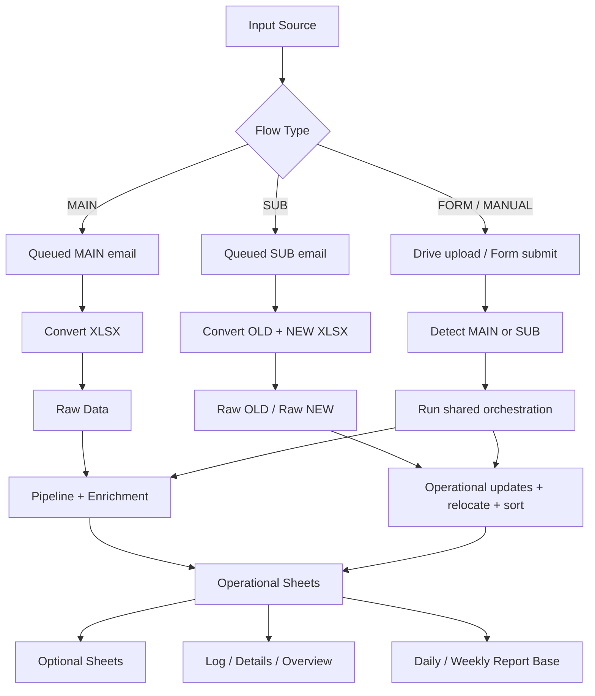
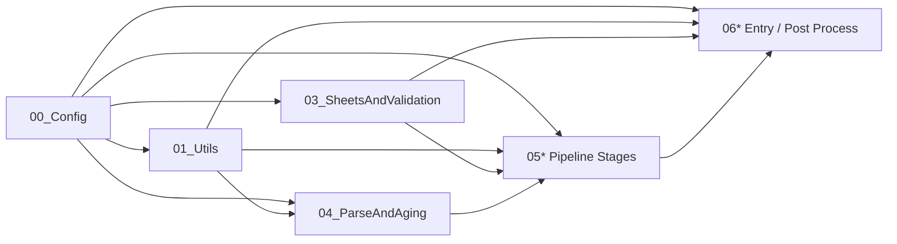
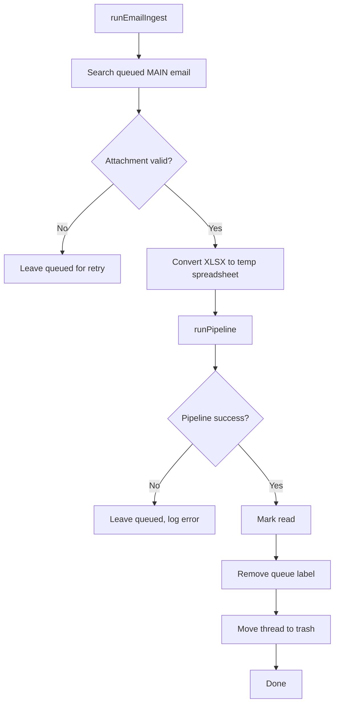
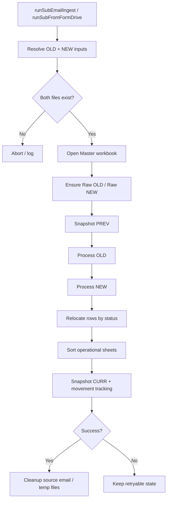
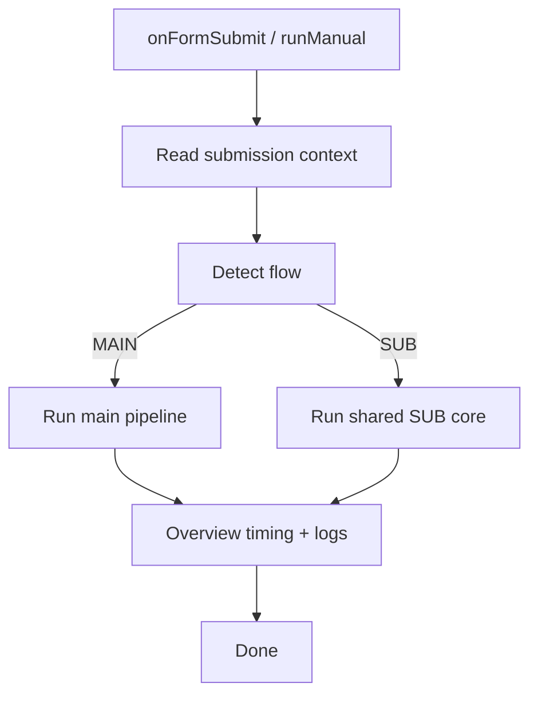

# Workflow Map

Dokumen ini menjelaskan peta alur utama repo `workflow` tanpa membuat dokumentasi jadi beranak-pinak tanpa alasan.

Gunakan file ini untuk dua hal:

1. memahami alur eksekusi cepat
2. menilai dampak perubahan sebelum edit kode

---

## High-level map

---

## Layer dependency map

Interpretasi praktis:

- `00_Config.gs` adalah policy backbone
- `01_Utils.gs` adalah utility backbone (termasuk helper header matching bersama seperti `findHeaderIndexByCandidates_`)
- `03_SheetsAndValidation.gs` adalah schema/layout backbone
- `06a_EntryPoints.gs` adalah orchestration entry backbone

Kalau salah satu dari empat titik ini berubah, biasanya dampaknya lintas modul.

---

## MAIN flow

### MAIN touchpoints

Kalau ingin mengubah MAIN, biasanya area yang terdampak:
- email query / queue policy → `00_Config.gs`, `06a_EntryPoints.gs`
- attachment selection → `01_Utils.gs`, `06a_EntryPoints.gs`
- pipeline execution → `06a_EntryPoints.gs`, `06b_PipelineAndEnrichment.gs`
- raw write / enrichment → `04_*`, `05*`, `06b_*`

---

## SUB flow

### SUB touchpoints

Kalau ingin mengubah SUB, biasanya area yang terdampak:
- old/new attachment detection → `06a_EntryPoints.gs`
- raw sheet naming / policy → `00_Config.gs`
- operational update fields → `06a_EntryPoints.gs`
- row relocation logic → `06a_EntryPoints.gs` + routing policy di `00_Config.gs`
- sorting criteria → `00_Config.gs` / `06a_EntryPoints.gs`
- movement tracking → `06c_PostProcessAndUtils.gs`

---

## FORM / MANUAL flow

### FORM touchpoints

Kalau ingin mengubah flow manual/form:
- field mapping / file upload interpretation → `00_Config.gs`, `06a_EntryPoints.gs`
- auto-detection MAIN vs SUB → `06a_EntryPoints.gs`
- progress / timing / log context → `06a_EntryPoints.gs`, `02_LogAndDetails.gs`

---

## Change impact map

### Update MAIN/SUB/FORM 2026-07-06

Perubahan kontrak terbaru:

- `Reject Claim` masuk operational flow. MAIN mengisi sheet ini untuk claim dengan `Last Status` mengandung `reject` dan `days_aging_from_last_activity` / `last_update_datetime` masih `<= 30` hari.
- SUB relocation memindahkan claim existing dari `Submission`, `Start`, SC universe, `Expired Claim`, atau sheet operasional lain ke `Reject Claim` jika status terbaru berubah menjadi reject dan masih dalam window 30 hari.
- Claim reject dengan aging/update `> 30` hari tidak dipaksa ke `Reject Claim`; claim tersebut mengikuti mapping exclusion/closed biasa.
- Mapping GSI pindah ke `SC - Meilani` dan `Service Center PIC = Meilani`. Keyword `Rejeki Seluler` / `Rejeki Seluller` masuk `SC - Farhan` dan `Service Center PIC = Farhan`.
- WebApp Movement Tracking sudah dikeluarkan dari runtime MAIN/SUB. `Daily Report Base` dan `Weekly Report Base` tetap aktif.
- Untuk efisiensi runtime, strict sync kedua setelah optional processors dibatasi hanya ke optional sheets yang baru ditulis (`B2B`, `EV-Bike`, `Doss`, `Special Case`).

### Update MAIN/SUB/FORM 2026-06-29

Perubahan kontrak terbaru:

- `DB`, `Status Type`, `Update Status Asso`, `Timestamp Asso`, `Update Status Admin`, dan `Timestamp Admin` tidak lagi dibuat/diisi oleh writer operational.
- `Aging Position` / `Aging Post.` dinormalisasi menjadi `Stage Aging`.
- `Stage Aging` diisi dari source aging per sheet dan tidak berlaku untuk `Submission`.
- SUB relocation membandingkan bucket status lama di `Raw Data` dan status baru di `Raw NEW`: bucket sama memakai aging source sheet tujuan dari `Raw Data`, bucket berubah atau referensi kosong mereset `Stage Aging` ke `0`.
- `Submission.TAT` dihitung lebih detail dari `claim_submitted_datetime` sampai runtime, sehingga nilai seperti `14,2` bisa muncul sesuai locale sheet.
- `CLAIM_EXPIRE` dan `CLAIM_EXPIRE_WALKIN` masuk ke sheet `Expired Claim`.
- `Expired Claim` ikut relocation SUB, sehingga klaim bisa bergerak keluar dari expired saat last status berubah.
- `EV-Bike` menerima klaim token `VVMAR` tanpa pengecualian status; `Doss` menerima klaim token `DOSS` dengan pola writer yang sama.
- `SC - Unmapped` mengecualikan klaim token `VVMAR` / `DOSS`.
- `Special Case` diproses MAIN-only; SUB/FORM tidak menjalankan writer atau strict sync terhadap sheet ini.
- SUB refresh ikut meng-upsert `EV-Bike` dan `Doss` dari `Raw OLD` / `Raw NEW`.
- MAIN/SUB expand active filters ke full used range sebelum write/sort supaya row yang sedang hidden/out-of-filter tetap ikut update.
- `Claimed Active Policies` menjadi flag prioritas tertinggi untuk highlight/note claim number.
- Strict sync `Submission Date` / `Submission by Month` berlaku untuk semua operational/optional sheets aktif; nilai boolean existing tidak dipakai sebagai fallback.
- `IMEI/SN` dipaksa plain text dan dinormalisasi tanpa separator koma.
- `Expired Claim` memakai fallback `Service Type = Ask Detail` untuk `CLAIM_EXPIRE` dan ikut autofill `Branch` / `Service Center PIC`.
- `Store Name` operational bersumber dari `Raw Data.outlet_name`.
- `B2B` MAIN dibatasi ke `id_business_partner_category_name = B2B Partnership`; SUB tidak rebuild B2B dan hanya update `Last Status` / `Service Center` pada row existing.
- `Special Case` MAIN memasukkan semua claim yang punya flag, tanpa pruning status done/closed.
- Service Center Extractor: Samsung Authorized by Unicom Pontianak/Samarinda/Banjarmasin diarahkan ke sheet `Samsung Exclusive`; Deltasindo Sorong/Office diarahkan ke `Deltasindo`.

### Jika menambah status baru
Minimal cek:
- `OPS_ROUTING_POLICY`
- `STATUS_TYPE_BY_LAST_STATUS`
- `POSITION_BY_LAST_STATUS`
- optional sheet rules jika status itu ikut B2B / PO / Special Case / Exclusion
- dokumentasi di `README.md` bila perubahan bersifat struktural

### Jika menambah kolom baru pada sheet operasional
Minimal cek:
- `SV03_TEMPLATES`
- formatting / checkbox / dropdown behavior di `03_SheetsAndValidation.gs`
- writer yang mengisi kolom itu
- apakah kolom itu source-driven, derived, atau manual-only

### Jika mengubah source of truth policy
Minimal cek:
- apakah policy dibaca sebagai global constant atau `CONFIG.*`
- apakah ada fallback legacy di module lain
- apakah dokumentasi README masih sesuai

### Jika mengubah routing SC
Minimal cek:
- `OPS_ROUTING_POLICY.SC_NAME_KEYWORDS`
- fallback sheet behavior
- relocate logic di SUB flow
- sheet template SC (karena ada kolom `Type` dan `Branch`)

### Jika mengubah optional sheet logic
Minimal cek:
- `05c_Pipeline_OptionalSheets.gs`
- flags/policy di `00_Config.gs`
- schema fixed vs non-fixed
- apakah sheet itu boleh auto-heal atau harus diperlakukan manual

### Jika mengubah Daily / Weekly Report Base
Minimal cek:
- `refreshReportBaseFromOperational06_` dan `fillWeeklyReportBase` di `06c_PostProcessAndUtils.gs`
- source sheet list operational termasuk `Reject Claim`
- gate SUB untuk weekly refresh agar runtime hourly tetap ringan
- dampak filter aktif dan jumlah row historis saat full rewrite report base

---

## Safe editing sequence

Urutan aman saat mau mengubah fitur:

1. identifikasi source of truth
2. identifikasi semua flow yang menyentuh rule itu
3. cek apakah sheet template ikut terdampak
4. cek apakah optional sheet ikut terdampak
5. baru edit kode
6. update dokumentasi jika impact-nya lintas layer

Kalau langkah 1 saja masih bingung, biasanya problem-nya bukan di implementasi dulu, tapi di dokumentasi atau kontrak layer yang belum cukup jelas.

---

## Minimal governance rules

Untuk menjaga repo tetap waras:

- jangan tambah file dokumentasi baru untuk hal yang masih muat di README atau file ini
- jangan campur utility generik dengan business rule baru
- jangan menaruh source of truth baru di file yang bukan policy layer tanpa alasan kuat
- kalau butuh fallback legacy, tandai jelas apakah itu sementara atau permanen

---

## Refactor priority map

Urutan refactor yang paling masuk akal:

1. **bug fix correctness**
   - header validation mismatch
   - inconsistent policy lookup

2. **discovery improvement**
   - section index di `00_Config.gs`
   - boundary docblock di function integrasi

3. **structural slimming**
   - kecilkan `06a_EntryPoints.gs`
   - rapikan backward compatibility branch yang sudah tidak perlu

Bukan sebaliknya. Jangan mulai dari operasi kosmetik besar yang hasil akhirnya cuma folder makin ramai.

## Part 9 — Final pass hardening + UAT checklist (MAIN/SUB/FORM)

Checklist ini fokus ke area yang paling rawan regressions pas perubahan terakhir.

### 1) Reset 4 kolom manual saat status berubah (SUB)
- Scope kolom: `Update Status`, `Timestamp`, `Status`, `Remarks`.
- UAT:
  1. pilih 1 claim existing di sheet operasional lalu isi manual ke-4 kolom.
  2. jalankan SUB dengan data NEW yang mengubah `Last Status` claim itu.
  3. verifikasi ke-4 kolom reset/clear sesuai policy.
  4. jalankan SUB lagi tanpa perubahan status, pastikan manual input tidak ikut terhapus.

### 2) B2B category gate
- Scope: B2B MAIN hanya berasal dari Raw Data dengan `id_business_partner_category_name = B2B Partnership`; SUB hanya update `Last Status` dan `Service Center` untuk row existing.
- UAT:
  1. siapkan 1 row Raw Data kategori `B2B Partnership` dan 1 row non-B2B.
  2. jalankan MAIN atau FORM (MAIN path) sampai optional sheets diproses.
  3. verifikasi hanya row kategori B2B yang muncul di sheet `B2B`.
  4. jalankan SUB dengan perubahan status/service center dan verifikasi hanya dua kolom itu yang berubah.

---

## FAQ Operasional — SC mapping saat `Service Center` kosong

Kasus ini penting dan sering bikin salah asumsi:

- Untuk status yang masuk universe SC (`SC - Farhan`, `SC - Meilani`, `SC - Meindar`), pemecahan target sheet dilakukan dari kolom source `Service Center Name / sc_name` via keyword match.
- Kalau `Service Center` di MAIN kosong / tidak match keyword, routing **fail-closed** ke sheet karantina `SC - Unmapped` (bukan dipaksa ke Farhan/Meilani/Meindar).
- Efeknya: claim belum muncul di SC owner sheet sampai SUB berikutnya membawa nilai `Service Center` yang valid, lalu claim akan pindah via relocate logic SUB.

Untuk 4 kolom manual (`Update Status`, `Timestamp`, `Status`, `Remarks`):

- Kolom tersebut dianggap manual field dan disnapshot sebelum clear.
- Saat write hasil route, sistem mencoba restore per `Claim Number` dari snapshot kalau nilai baris baru kosong.
- Artinya:
  - kalau claim sudah pernah ada sebelumnya di target sheet yang sama, nilai manual akan dipertahankan;
  - kalau claim baru (belum ada snapshot), default-nya kosong;
  - jika claim awalnya masuk `SC - Unmapped`, manual field di SC owner sheet tetap kosong sampai claim benar-benar diroute ke sheet owner terkait.

### 3) Reject Claim routing
- Scope: MAIN initial routing dan SUB relocation.
- UAT:
  1. siapkan claim dengan `Last Status` mengandung `reject` dan `days_aging_from_last_activity <= 30`.
  2. jalankan MAIN dan verifikasi row masuk `Reject Claim`.
  3. ubah claim existing di sheet lain via SUB menjadi status reject dengan aging <=30, lalu verifikasi row pindah ke `Reject Claim`.
  4. ulangi dengan aging >30 dan pastikan tidak masuk `Reject Claim`.

### 4) SC mapping GSI / Rejeki Seluler
- Scope: MAIN routing, SUB relocation, Service Center PIC, optional project extractor/salvage.
- UAT:
  1. service center mengandung `GSI` harus masuk `SC - Meilani` dan PIC `Meilani`.
  2. service center mengandung `Rejeki Seluler` harus masuk `SC - Farhan` dan PIC `Farhan`.

### 5) EV-Bike overlay + TAT derivation
- Scope: overlay dari `Submission`, plus isi `TAT` ketika raw `days_aging_from_submission` kosong.
- UAT:
  1. siapkan 1 claim EV-Bike di `Submission` dengan `Submission Date` valid.
  2. pastikan claim tidak punya nilai `TAT` dari raw source.
  3. jalankan MAIN/FORM dan verifikasi row EV-Bike ter-overlay + `TAT` terisi dari derivasi tanggal.
  4. cek log `EVBIKE_METRICS` untuk melihat `submission_overlay` > 0 pada run uji.

### 4) Daily + Weekly Report Base sync
- Scope:
  - refresh `Daily Report Base` (fallback ke `Report Base` lama) dari jalur operasional.
  - build historis `Weekly Report Base` dari agregasi `Daily Report Base` pada akhir MAIN.
- UAT:
  1. jalankan MAIN end-to-end.
  2. pilih sampel claim dari beberapa posisi (Start/Finish/SC/Exclusion).
  3. cocokkan `Claim Number`, `Position`, `Service Center`, dan `PIC` antara sumber operasional vs `Daily Report Base`.
  4. pastikan tidak ada duplikasi claim di `Daily Report Base`.
  5. cek `Weekly Report Base` terisi row agregasi untuk snapshot saat ini (termasuk `Count`, `Previous Count`, `Daily Change`, `Is Last 7 Days`).
  6. rerun MAIN di tanggal snapshot yang sama -> pastikan replace snapshot berjalan (tidak duplikat tanggal yang sama).

### 5) Gate sebelum release
- Semua flow `runSelfCheck_()` harus `ok=true`.
- Tidak ada warning baru terkait simbol kritikal pipeline.
- UAT 1-4 di atas lulus minimal pada 3 sampel claim berbeda.

## Weekly Report Base quick-reference (2026-05-06)

- Function utama: `fillWeeklyReportBase(snapshotDateOverride, sourceFileName)`.
- Dipanggil di akhir MAIN pipeline setelah:
  1) refresh `Daily Report Base`,
  2) `SpreadsheetApp.flush()`,
  3) `Utilities.sleep(3000)`.
- Pada jalur MAIN, fungsi dipanggil dengan context spreadsheet aktif pipeline (`ss`) untuk menghindari error `Spreadsheet tidak ditemukan` pada runtime non-active.
- Snapshot date priority:
  1. `snapshotDateOverride`,
  2. extract dari `sourceFileName` dengan pola `yyyy-MM-dd` sebelum `T`,
  3. fallback hari ini (timezone spreadsheet).
- Perilaku penting:
  - replace row existing pada snapshot date yang sama (idempotent rerun),
  - preserve history tanggal lain,
  - generate zero-row terbatas untuk kombinasi yang hilang dari previous snapshot date terdekat,
  - recalculate full helper (`Previous Snapshot Date`, `Previous Count`, `Daily Change`, `Is Last 7 Days`) untuk antisipasi backfill.
  - setelah write selesai, filter aktif di sheet target disinkronkan ke full used range dengan mempertahankan filter criteria yang ada (agar row baru yang match filter bisa langsung ikut terlihat).
  - `Submission Date` di routing operasional hanya diisi dari source `Raw Data.claim_submission_date` yang berhasil diparse menjadi tanggal valid (tidak fallback ke raw string non-date).
  - `Special Case` tidak lagi mewajibkan kolom legacy `Start Date`/`End Date`/`Details`; detail alasan tetap tersedia melalui note pada kolom `Reason`.

## Recent hardening notes (2026-04-27)

Catatan ini dipakai sebagai quick-reference maintenance (bukan detail desain):

- Routing/position: `DONE_EXPIRED` harus tetap konsisten ke domain `Exclusion` (hindari drift antara routing map vs position map).
- `Submission by Month` diperlakukan sebagai date bulanan (tanggal 1) dengan display `MMM yy` agar tetap bisa dipakai formula/pivot tanpa kehilangan tampilan bisnis.
- Optional sheets (B2B/EV-Bike): excluded-status filtering wajib case-insensitive agar aman terhadap variasi casing dari source.
- B2B partner matching sudah include tambahan partner enterprise terbaru (Bhinneka/PSMS/DIGIMAP EnE/Parastar/GSE/KPD/Tukar Ind/Bumilindo).
- `Submission Date` wajib strict dari `Raw Data.claim_submission_date` (tanpa fallback field lain).
- Setelah routing+enrichment, kolom `Submission Date` di sheet operasional utama (`Submission`,`Ask Detail`,`Start`,`Finish`,`PO`,`B2B`,`Special Case`) di-overwrite ulang dari mapping `Claim Number -> Raw Data.claim_submission_date` untuk mencegah kebocoran nilai dari kolom lain (mis. `OR`/`Remarks`).
- Sinkronisasi strict `Submission Date`/`Submission by Month` dijalankan ulang setelah optional processors (`B2B`/`EV-Bike`/`Special Case`) supaya row hasil rebuild `B2B` (termasuk FORM - MAIN) tetap terisi.
- Sync `Daily Report Base` pasca SUB memakai full rewrite (non-incremental) dan melepas filter sheet sebelum write untuk mencegah stale rows saat sheet sedang difilter.
- PIC fallback `Daily Report Base`: jika position tidak terpetakan tapi SC keyword match, isi PIC berdasarkan keyword SC (contoh `B-Store` -> `Meindar`).
- `Weekly Report Base` refresh rule: `SUB` pure wajib gate jam 09:00 + 1x per tanggal (script timezone), sedangkan `FORM - SUB` boleh refresh saat flow selesai (bukan `FORM - MAIN`).
- Manual override tersedia lewat fungsi `runWeeklyReportBaseManual(...)` untuk force refresh `Weekly Report Base` dari `Daily Report Base` tanpa menunggu flow otomatis.
- Enrichment `Submission by Month` juga diterapkan ke sheet `B2B` untuk menjaga konsistensi agregasi `Daily Report Base`.
- Relokasi SUB tetap mengecualikan `EV-Bike`, tapi `Exclusion` wajib ikut scope relokasi agar perubahan status ke domain exclusion benar-benar berpindah lintas sheet.

- Mapping `Exclusion` mencakup tambahan `INSURANCE_CLAIM_WAITING_PAID` dan `CLAIM_CANCELLED`.

Saat ada update policy berikutnya, cek ulang 3 titik ini secara berurutan:
1. `00_Config.gs` (policy source of truth)
2. `05c_Pipeline_OptionalSheets.gs` (matching + fallback behavior)
3. `06b/06c` (formatting & report propagation)
