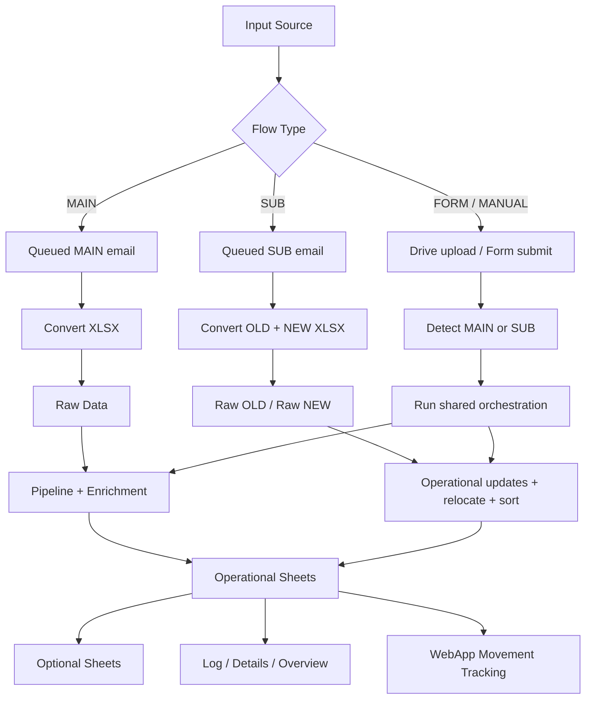
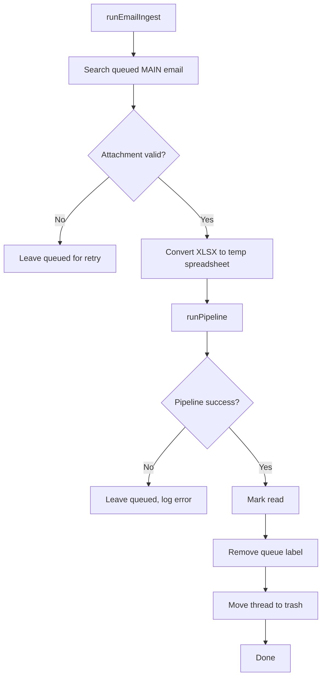
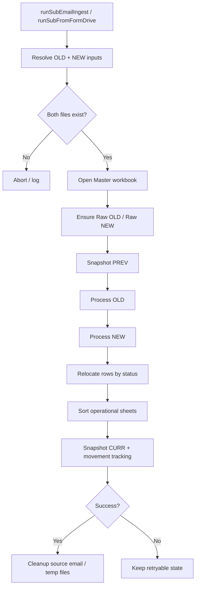
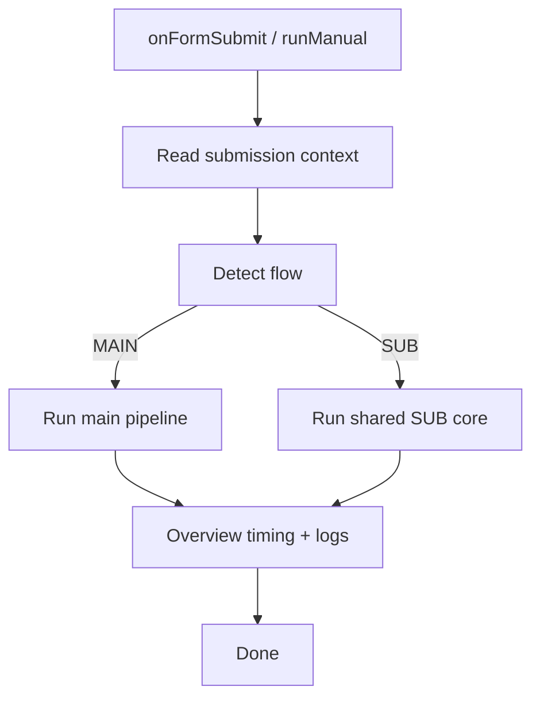

# Workflow Map

Dokumen ini menjelaskan peta alur utama repo `workflow` tanpa membuat dokumentasi jadi beranak-pinak tanpa alasan.

Gunakan file ini untuk dua hal:

1. memahami alur eksekusi cepat
2. menilai dampak perubahan sebelum edit kode

---

## High-level map



---

## Layer dependency map

```mermaid
flowchart LR
    A[00_Config] --> B[01_Utils]
    A --> C[03_SheetsAndValidation]
    A --> D[04_ParseAndAging]
    A --> E[05* Pipeline Stages]
    A --> F[06* Entry / Post Process]
    F --> G[06e_SubHelpers.gs (SUB internals)]
    F --> H[06f_RuntimeAssertions.gs (preflight checks)]

    B --> D
    B --> E
    B --> F

    C --> E
    C --> F

    D --> E
    E --> F
```

Interpretasi praktis:

- `00_Config.gs` adalah policy backbone
- `01_Utils.gs` adalah utility backbone (termasuk helper header matching bersama seperti `findHeaderIndexByCandidates_`)
- `03_SheetsAndValidation.gs` adalah schema/layout backbone
- `06a_EntryPoints.gs` adalah orchestration entry backbone

Kalau salah satu dari empat titik ini berubah, biasanya dampaknya lintas modul.

---

## MAIN flow



### MAIN touchpoints

Kalau ingin mengubah MAIN, biasanya area yang terdampak:
- email query / queue policy → `00_Config.gs`, `06a_EntryPoints.gs`
- attachment selection → `01_Utils.gs`, `06a_EntryPoints.gs`
- pipeline execution → `06a_EntryPoints.gs`, `06b_PipelineAndEnrichment.gs`
- raw write / enrichment → `04_*`, `05*`, `06b_*`

---

## SUB flow



### SUB touchpoints

Kalau ingin mengubah SUB, biasanya area yang terdampak:
- old/new attachment detection → `06a_EntryPoints.gs`
- raw sheet naming / policy → `00_Config.gs`
- operational update fields → `06a_EntryPoints.gs`
- row relocation logic → `06a_EntryPoints.gs` + routing policy di `00_Config.gs`
- sorting criteria → `00_Config.gs` / `06a_EntryPoints.gs`
- movement tracking → `06c_PostProcessAndUtils.gs`

---

## FORM / MANUAL flow



### FORM touchpoints

Kalau ingin mengubah flow manual/form:
- field mapping / file upload interpretation → `00_Config.gs`, `06a_EntryPoints.gs`
- auto-detection MAIN vs SUB → `06a_EntryPoints.gs`
- progress / timing / log context → `06a_EntryPoints.gs`, `02_LogAndDetails.gs`

---

## Change impact map

### Jika menambah status baru
Minimal cek:
- `OPS_ROUTING_POLICY`
- `STATUS_TYPE_BY_LAST_STATUS`
- `POSITION_BY_LAST_STATUS`
- optional sheet rules jika status itu ikut B2B / PO / Special Case / Exclusion
- dokumentasi di `README.md` bila perubahan bersifat struktural

### Jika menambah kolom baru pada sheet operasional
Minimal cek:
- `SV03_TEMPLATES`
- formatting / checkbox / dropdown behavior di `03_SheetsAndValidation.gs`
- writer yang mengisi kolom itu
- apakah kolom itu source-driven, derived, atau manual-only

### Jika mengubah source of truth policy
Minimal cek:
- apakah policy dibaca sebagai global constant atau `CONFIG.*`
- apakah ada fallback legacy di module lain
- apakah dokumentasi README masih sesuai

### Jika mengubah routing SC
Minimal cek:
- `OPS_ROUTING_POLICY.SC_NAME_KEYWORDS`
- fallback sheet behavior
- relocate logic di SUB flow
- sheet template SC (karena ada kolom `Type` dan `Branch`)

### Jika mengubah optional sheet logic
Minimal cek:
- `05c_Pipeline_OptionalSheets.gs`
- flags/policy di `00_Config.gs`
- schema fixed vs non-fixed
- apakah sheet itu boleh auto-heal atau harus diperlakukan manual

### Jika mengubah movement tracking WebApp
Minimal cek:
- `WEBAPP_MOVEMENT_POLICY` (termasuk batas scan histori `Past`)
- helper load existing event id (`__loadExistingEventIds06c_`)
- urutan snapshot PREV/CURR dan dedup Event ID
- dampak performa saat jumlah baris histori besar

---

## Safe editing sequence

Urutan aman saat mau mengubah fitur:

1. identifikasi source of truth
2. identifikasi semua flow yang menyentuh rule itu
3. cek apakah sheet template ikut terdampak
4. cek apakah optional sheet ikut terdampak
5. baru edit kode
6. update dokumentasi jika impact-nya lintas layer

Kalau langkah 1 saja masih bingung, biasanya problem-nya bukan di implementasi dulu, tapi di dokumentasi atau kontrak layer yang belum cukup jelas.

---

## Minimal governance rules

Untuk menjaga repo tetap waras:

- jangan tambah file dokumentasi baru untuk hal yang masih muat di README atau file ini
- jangan campur utility generik dengan business rule baru
- jangan menaruh source of truth baru di file yang bukan policy layer tanpa alasan kuat
- kalau butuh fallback legacy, tandai jelas apakah itu sementara atau permanen

---

## Refactor priority map

Urutan refactor yang paling masuk akal:

1. **bug fix correctness**
   - header validation mismatch
   - inconsistent policy lookup

2. **discovery improvement**
   - section index di `00_Config.gs`
   - boundary docblock di function integrasi

3. **structural slimming**
   - kecilkan `06a_EntryPoints.gs`
   - rapikan backward compatibility branch yang sudah tidak perlu

Bukan sebaliknya. Jangan mulai dari operasi kosmetik besar yang hasil akhirnya cuma folder makin ramai.
